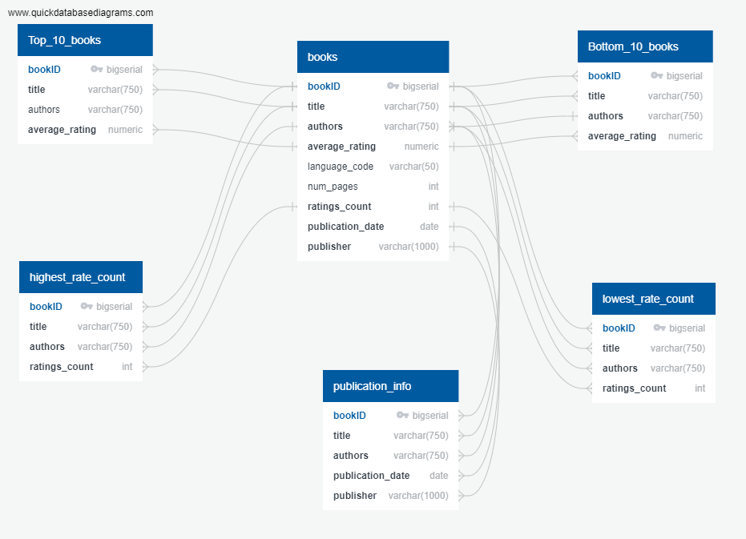
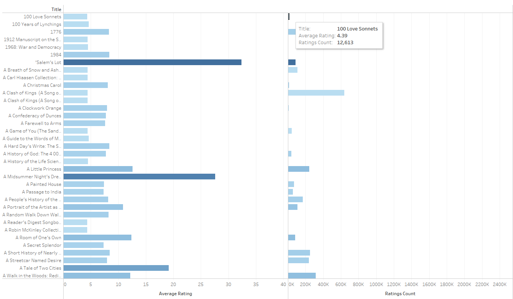

# SQL-book-study

## Project Description
This study was used to determine which books held popularity amoung the data found in the provided CSV file.
 *Disclaimer- Due to Goodreads no longer issuing new developer keys for their public developer API, this information was last updated December 8th, 2020. 

## Resources
### Software
* SQL
* QuickDBD
* pgAdmin4
* Microsoft Excel
* Tableau

### Data Source
* [books.csv](https://github.com/anrobertson/SQL-book-study/blob/main/Original%20CSV/books.csv)

I retrieved the "books.csv" file from [Kaggle](https://www.kaggle.com/datasets/jealousleopard/goodreadsbooks). ** The creater of this dataset Soumik Ranjan Dasgupta 
who modified it last in 2020. Using the QuickDBD program, I mapped out each table with their columns, the column data types and whether they were a primary key or a foreign key. I then imported the SQL file and brought it into pgAdmin4 to better search for my results. When I first created my tables, I wanted to pull books with the top ten books the bottom ten books, which ten had the highest rating count and which ten had the lowest rating count; but I then came to see that it wasn't enough information for me to make a solid observation. I ended up creating two new tables and used the 'ORDER BY' function to get one table with rating average ascending and the other descending.
Creating the tables this way allowed me to see both the average waiting and rate count within the same table with more books from comparison. In addition to those two tables, I created another table that gave us the publication information such as, the publication year and who the publishers. 
### QuickDBD

After creating these new CSV files, I took the information to Tableau to create a visual. As you can see in the example down below, I created a horizontal bar chart that 
shows the average rating and the amount of individuals who have rated the book. The design allows views to scroll over the chart to obtain the information that has been filtered. In this scenario, when you scroll over the chart, you can see the title name, the average rating and the rating count.
### Tableau

